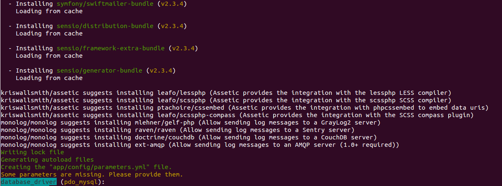
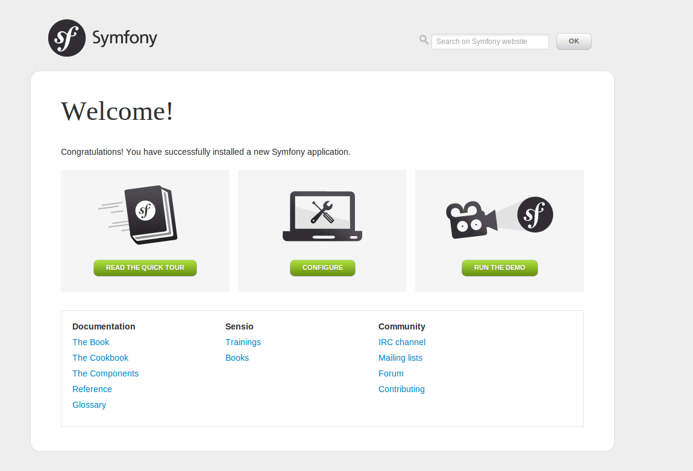

# Instalación

Aunque Symfony puede ser descargado y descomprimido directamente allí donde lo queramos dejar, en este curso vamos a utilizar desde el principio el gestor de dependencias *composer*. Esta guía describe el proceso de instalación en una máquina basada en Debian. Para otros sistemas operativos, consultad la [guía de instalación](http://symfony.com/doc/current/book/installation.html) en la web del framework.

## Cómo descargar composer

Situaos en el directorio desde el que pendan los distintos sites del servidor. Por ejemplo, `/var/www`.

```bash
$ sudo apt-get install curl
$ curl -sS https://getcomposer.org/installer | php
```


## Cómo instalar Symfony 2

En el mismo directorio donde hayáis descargado composer, ejecutad la siguiente instrucción:

```
$ php composer.phar create-project symfony/framework-standard-edition nombre-de-mi-proyecto/
```

Tras descargar los componentes necesarios, el terminal nos pedirá interactivamente que le proporcionemos cierta información:




- *database_driver*: Configura el motor de base de datos a utilizar para la instalación. Algunas opciones son `pdo_mysql` o `pdo_sqlite`. Recuerda que necesitarás tener instaladas en tu equipo las extensiones correspondientes.
- *database_host*: La máquina donde se aloja la base de datos. Por defecto la máquina local (127.0.0.1).
- *database_port*: El puerto mediante el cual se accede a la base de datos. Dejándolo a `null` se utilizará el puerto por defecto del motor elegido.
- *database_name*: Nombre de la base de datos de la instalación.
- *database_user*: Usuario con el que se accederá a la base de datos.
- *database_password*: Contraseña del usuario de la base de datos.
- *mailer_transport*: Protocolo de transporte a utilizar en el envío de emails. Algunas opciones son `sendmail` o `smtp`.
- *mailer_user*: Si aplica, usuario a utilizar para el envío de emails.
- *mailer_password*: Si aplica, contraseña del usuario para el envío de emails.
- *local*: Localización idiomática del sitio. Afecta, por ejemplo, al modo en el que se formatean las fechas y a los ficheros de traducción cargados.
- *secret*: Esta clave es utilizada por Symfony en sus mecanismos de encriptación. ¡No te olvides de cambiarla!.


Una vez proporcionados los parámetros necesarios daremos permisos de escritura a los directorios `app/cache` y `app/logs` [tal y como se describe en la web oficial](http://symfony.com/doc/current/book/installation.html#configuration-and-setup).


```
$ APACHEUSER=`ps aux | grep -E '[a]pache|[h]ttpd' | grep -v root | head -1 | cut -d\  -f1`
$ sudo setfacl -R -m u:$APACHEUSER:rwX -m u:`whoami`:rwX app/cache/ app/logs/
$ sudo setfacl -dR -m u:$APACHEUSER:rwX -m u:`whoami`:rwX app/cache/ app/logs/
```


## Ejemplo de configuración en Apache web server


```
<VirtualHost *:80>
        ServerAdmin mi@mail.es
        ServerName local.symfony.com

        DocumentRoot /var/www/vhosts/symfony/web
        <Directory /var/www/vhosts/symfony/web>
                AllowOverride None

                RewriteEngine On
                RewriteCond %{REQUEST_FILENAME} !-f
                RewriteRule ^(.*) app.php [QSA,L]
        </Directory>

        ErrorLog ${APACHE_LOG_DIR}/symfony-error.log

        # Possible values include: debug, info, notice, warn, error, crit,
        # alert, emerg.
        LogLevel warn

        CustomLog ${APACHE_LOG_DIR}/access.log combined
</VirtualHost>
```


## ¡Bienvenido!

Tras configurar el servidor web para que dirija correctamente las peticiones al sitio podremos acceder a él desde nuestro navegador en `http://tu-site-symfony.com/app_dev.php/`.



Tómate tu tiempo curioseando tu instalación. ¡Enhorabuena!.

