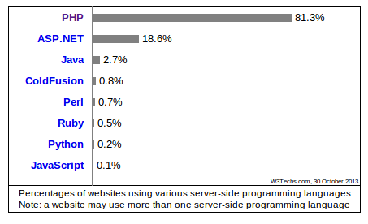

# La evolución de PHP y los frameworks MVC

PHP nace en 1995 de la mano de Rasmus Lerdorf, en una época donde emergen otros lenguajes de tipado dinámico como Python o Ruby. Fue concebido para el *desarrollo de webs dinámicas* y a día de hoy es el lenguaje más extendido entre los servidores web, según [w3techs.com](http://w3techs.com).

Entre los motivos que explican la expansión de PHP podemos encontrar su suave curva de aprendizaje, la facilidad de instalación y configuración en cualquier entorno y la actual presencia de programadores en el mercado. Al ser un lenguaje interpretado, el despliegue de actualizaciones es tan sencillo como sobreescribir los ficheros existentes, por lo que el proceso de desarrollo se acelera con respecto a los lenguajes compilados como Java.

Pese a todos estos logros, PHP sigue estando muy mal considerado por amplios sectores de la comunidad de desarrolladores. ¿Por qué? Para responder a esta pregunta podemos partir de las decisiones en el diseño del lenguaje (un ejemplo, la cantidad y desorden de funciones para manejar arrays), pero también por su comunidad. Las mismas ventajas del lenguaje han atraído a multitud de programadores semi-profesionales o amateurs, y esto ha ayudado a generalizar las malas prácticas entre los proyectos PHP. Plataformas como Drupal o Wordpress [han extendido en gran medida esta imagen](https://api.drupal.org/api/drupal/modules%21user%21user.module/function/user_save/7).

Podemos decir, sin embargo, que la comunidad PHP ya ha superado el punto de inflexión y empieza a remontar. La versión 5.0 y posteriores han intentado enmendar los errores del pasado con algunos cambios importantes, como el soporte para orientación a objetos y closures, entre otros.

Uno de las mayores transformaciones ha sido la aparición de diversos frameworks de desarrollo que ha impulsado la estandarización y difusión de buenas prácticas entre la comunidad de desarrolladores. Entre esos frameworks, Symfony en su segunda versión es tal vez el más influyente en la actualidad.

| Framework   | Lenguaje  | Año de lanzamiento | Versión actual |
|-------------|-----------|--------------------|----------------|
| CodeIgniter |      PHP  |               2002 |    2.1.3       |
| Ruby on Rails |   Ruby  |               2004 |    4.0.0       |
| CakePHP     |      PHP  |               2005 |    2.4.1       |
| Symfony     |      PHP  |               2005 |    2.3.3       |
| Django      |   Python  |               2005 |    1.5.5       |
| Turbogears  |   Python  |               2005 |    1.0         |
| Zend        |      PHP  |               2006 |    2.2.4       |
| web2py      |   Python  |               2007 |    2.6.3       |
| Sinatra     |     Ruby  |               2007 |    1.4.2       |
| Yii         |      PHP  |               2008 |    1.1.14      |
| Tornado     |   Python  |               2009 |    3.0         |
| Padrino     |     Ruby  |               2010 |    0.11.10     |
| Laravel     |      PHP  |               2013 |    4.0.7       |
| Silex       |      PHP  |               2010 |    1.1         |

Fuente: [Comparison of web application frameworks, Wikipedia](http://en.wikipedia.org/wiki/Comparison_of_web_application_frameworks)

De entre los freworks, podemos distinguir los monolíticos y los basados en componentes. Symfony 2 pertenece al segundo grupo.
