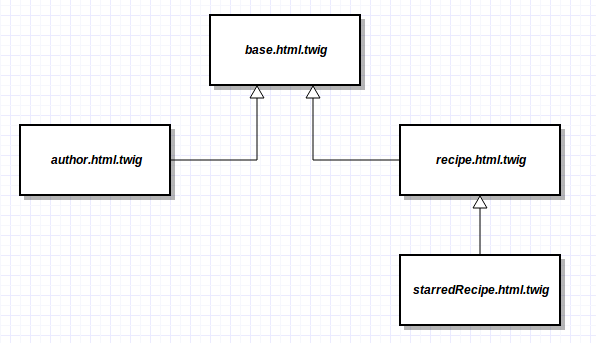

# Layouts y herencia

Todas las aplicaciones web disponen de al menos un layout. El layout define la estructura fundamental de la web, los estilos, bloques, menús y otros elementos que serán compartidos por las distintas URLs de la aplicación. En Twig, las plantillas pueden compartir un mismo layout a través de la herencia. La herencia en twig no se limita a un nivel, y es bastante común utilizar hasta tres niveles de herencia.




## Layouts
Los layouts de las aplicaciones Symfony se almacenan en `app/Resources/views`. Si disponemos de un solo layout, por convenio suele denominarse `base.html.twig`, aunque no estamos obligados a ello. La instalación estándar de Symfony proporciona un layout básico.


```html
<!DOCTYPE html>
<html>
    <head>
        <meta charset="UTF-8" />
        <title>Welcome!</title>
        
        <link rel="icon" type="image/x-icon" href="{{ asset('favicon.ico') }}" />
    </head>
    <body>
        
        
    </body>
</html>
```

El layout no extiende a ninguna otra plantilla. Al contrario, su cometido es facilitar una estructura común a la que puedan adherirse el resto. El elemento más importante de un layout es el tag `block`.


## Herencia

En el layout anterior podemos ver cuatro bloques. Las plantillas que extiendan el layout pueden personalizar el contenido de cada uno de ellos, aunque no están obligadas a hacerlo. Si no lo hacen, se mostrará el contenido de la plantilla padre. A continuación se muestra un ejemplo de una plantilla extendiendo el layout.

```html
<!-- src/My/RecipesBundle/Resources/views/Recipe/show.html.twig -->


{{ recipe.name }}


    <h1>{{ recipe.name }}</h1>
    <h2>Por {{ recipe.author }}</h2>

    <p>{{ recipe.description }}</p>

    <h3>Ingredientes</h3>
    <ul>
        
            <li>
                {{ ingredient }}
            </li>
        
    </ul>

```

El tag `extends` debe ocupar siempre la primera línea de una plantilla hija. La sintaxis que utiliza se basa en el siguiente patrón: `{bundle}:{controlador}:{plantilla}`. En este caso no se ha definido un bundle ni un controlador, por lo que la plantilla se buscará en el directorio de la aplicación: `app/Resources/views/`.

El orden en el que se definan los bloques sobreescritos no es importante. En este caso, la plantilla ha sobreescrito los bloques `title` y `body`, pero ha dejado los bloques `stylesheets` y `javascripts` intactos.


