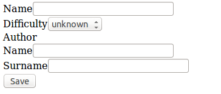

# Formularios embebidos

Hasta ahora hemos visto formularios sobre una única entidad. A menudo, sin embargo, necesitamos representar varias entidades relacionadas en un solo formulario. Symfony facilita la tarea a través de los formularios embebidos.

Nota: en castellano no existe la palabra embebido. Es un barbarismo que utilizaremos en este material como sinónimo de _incrustado_ o _empotrado_.


## Embeber un formulario
Hasta ahora hemos escrito un formulario para recetas y otro para autores. Vamos a crear un único formulario que permita insertar de un solo golpe una receta y su autor.

Nos aseguraremos de que la entidad `Recipe` dispone de los setters y getters necesarios:

```php
// src/My/RecipesBundle/Entity/Recipe.php

class Recipe
{
	// ...

    public function getAuthor()
    {
        return $this->author;
    }

    public function setAuthor(Author $author)
    {
        $this->author = $author;
        return $this;
    }
}
```

En el formulario `AuthorType` añadiremos un poco de información para que el componente de formularios sepa cómo debe tratar al objeto subyacente.

```php
// src/My/RecipesBundle/Form/Type/AuthorType.php

class AuthorType extends AbstractType
{
	// ...

    public function setDefaultOptions(OptionsResolverInterface $resolver)
    {
        $resolver->setDefaults(array(
            'data_class' => 'My\RecipesBundle\Entity\Author',
            // ...
        ));
    }
}
```


Y finalmente modificaremos el formulario `RecipeType` para reutilizar el formulario `AuthorType`. Previamente habremos definido el formulario de Author como servicio.

```yaml
services:
	# ...

    my_recipes.form.type.author:
        class: My\RecipesBundle\Form\Type\AuthorType
        tags:
            - { name: form.type, alias: author }
```


```php
// src/My/RecipesBundle/Form/Type/RecipeType.php
class RecipeType extends AbstractType
{
    public function buildForm(FormBuilderInterface $builder, array $options)
    {
        $builder
            ->add('name', 'text')
            ->add('difficulty', 'difficulty')
            ->add('author', 'author')
            ->add('save', 'submit');
    }

    // ...
}
```

Con esta configuración deberíamos ver el siguiente formulario en el navegador.


Como se aprecia en la imagen, se están renderizando dos botones de _submit_. Esto es así porque tanto en la clase `AuthorType` como en `RecipeType` se está añadiendo el correspondiente submit. Para evitarlo eliminaremos el componente submit del form `AuthorType`.

```php
// src/My/RecipesBundle/Form/Type/AuthorType.php

class AuthorType extends AbstractType
{
    public function buildForm(FormBuilderInterface $builder, array $options)
    {
        $builder
            ->add('name', 'text')
            ->add('surname', 'text');
    }

    // ...
}
```




Deberemos incluir explicitamente el botón en la vista que renderiza por separado el formulario de autor.

```html
{# src/My/RecipesBundle/Resources/views/Author/create.html.twig #}

	<ul>
		<!-- ... -->
        <li>
            <input type="submit" value="Add author" />
        </li>
    </ul>
    {{ form_end(form) }}

```

Ahora sí, cuando creemos una receta se creará automáticamente el autor seleccionado. El último paso es propagar la validación a los formularios embebidos. Para ello modificaremos `RecipeType`.

```php
// src/My/RecipesBundle/Form/Type/RecipeType.php

class RecipeType extends AbstractType
{
	// ...

    public function setDefaultOptions(OptionsResolverInterface $resolver)
    {
        $resolver->setDefaults(array(
            'data_class' => 'My\RecipesBundle\Entity\Recipe',
            'cascade_validation' => true,
        ));
    }
}
```


== EMBED FORMS ==
- Embed form
	- form collections


== FORM EVENTS ==


== DATA TRANSFORMERS ==

== Consultas a entidades => a repo ==

== THEMING ==
- Form theming

